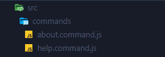
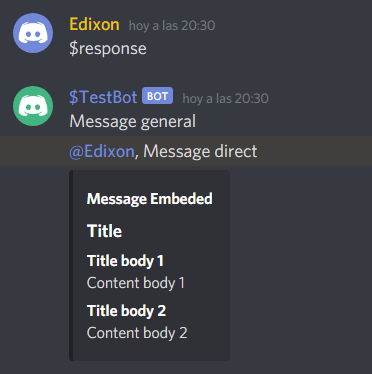
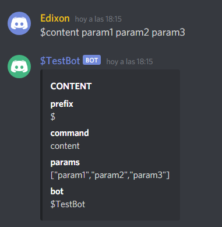

# Concord

<div align="center">
  
</div>

A micro-framework to create Discord bots by abstracting the **discord.js** library. With
concord you can create bots for Discord quickly. 🚀

Created with Node.js and TypeScript, all types are exposed for use. &nbsp;
 +
💗

---

## Installation

<!-- TODO: -->

---

## Create Bot

Create an instance of a bot.

```js
const { Bot } = require('@edixon/concord');

const bot = new Bot({
  token: 'DISCORD_TOKEN',
  prefix: '$'
});
```

## Command File

Create file in location: `./src/commands` with the following format:
`[command_name].command.js`. Concord will automatically convert each file into executable
commands.



You can also indicate the spefecific path where you want to save your commands.

```js
const bot = new Bot({
  commandsPath: 'COMMANDS_PATH'
});
```

## Create Commands

Commnad files can be interpreted as commands as long as they export a function with the
command name.

- javascript

```js
module.exports.commandName = async ({ content, response }) => {};
```

- typescript

```ts
type TCommand = import('@edixon/concord').TCommand;

export const commandName = async ({ content, response }: TCommand): Promise<void> => {};
```

Concord contains a default command to test the connection with the bot.


## Parameters

### Responses

- `general [Function]`: Send a general message

- `direct [Function]`: Send a direct message to the user whon

- `embeded [Function]`

Data estructure of response embeded:

```js
response.embeded({
  header: {
    text: 'text',
    img: 'url image',
    url: 'link'
  },
  imageHeader: 'url image',
  title: 'title',
  body: [
    {
      title: 'title',
      content: 'content',
      fieldType: 'column' // default: row
    }
  ],
  color: 'color in hexadecimal',
  footer: 'footer'
});
```

Example:

```js
module.exports.response = async ({ content, response }) => {
  response.general('Message general');

  response.direct('Message direct');

  response.embeded({
    header: 'Message Embeded',
    title: 'Title',
    body: [
      {
        title: 'Title body 1',
        content: 'Content body 1'
      },
      {
        title: 'Title body 2',
        content: 'Content body 2'
      }
    ]
  });
};
```



### Content

- `prefix [String]`: Contains the prefix set when creating the bot.

- `command [String]`: Contains the name of the commnand used.

- `params [Array]`: Contains a list od messages sent after the command name. Only one
  should be used to separate messages.

- `message [Function]`: Return an object containing the "message" instance with all the
  properties described in the Message class of discord.js.

Example:

```js
module.exports.content = async ({ content, response }) => {
  const { prefix, command, params, message } = content;

  const bot = message().channel.client.user.username;

  response.embeded({
    header: 'CONTENT',
    body: [
      {
        title: 'prefix',
        content: prefix
      },
      {
        title: 'command',
        content: command
      },
      {
        title: 'params',
        content: JSON.stringify(params)
      },
      {
        title: 'bot',
        content: bot
      }
    ]
  });
};
```



## Technologies in use

- Node.js
- TypeScript
- Yarn Workspces
- discord.js

## License

<!-- TODO: -->
