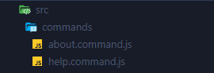
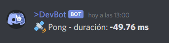

# Concord

A micro-framework to create Discord bots by abstracting the discord.js library. With
concord you can create bots for discord quickly. 🚀

### Get Stared

Create an instance of a bot.

```js
const { Bot } = require('@edixon/concord');

const bot = new Bot({
  token: 'DISCORD_TOKEN',
  prefix: '$',
  color: '#566CB5'
});
```

Create file in location: `./src/commands` with the following format:
`[name_command].command.js`. Concord will automatically convert each file into executable
commands.



You can also indicate the spefecific path where you want to save your commands.

```js
const bot = new Bot({
  commandsPath: 'COMMANDS_PATH'
});
```

### Command files

Commnad files can be interpreted as commands as long as they export a function with the
command name.

```js
module.exports.commandName = async ({ content, response }) => {};
```

Concord


