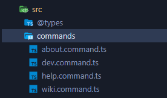

# Concord

A micro-framework to create Discord bots by abstracting the discord.js library. With
concord you can create bots for discord quickly 🚀.

### Get Stared

Create an instance of a bot.

```ts
const bot = new Bot({
  token: 'DISCORD_TOKEN',
  prefix: 'PREFIX',
  color: '#566CB5'
});
```

Create file in location: `/src/commands` with the followinf format:
`[name_command].command.ts`. Concord will automatically convert each file into executable
commands.


